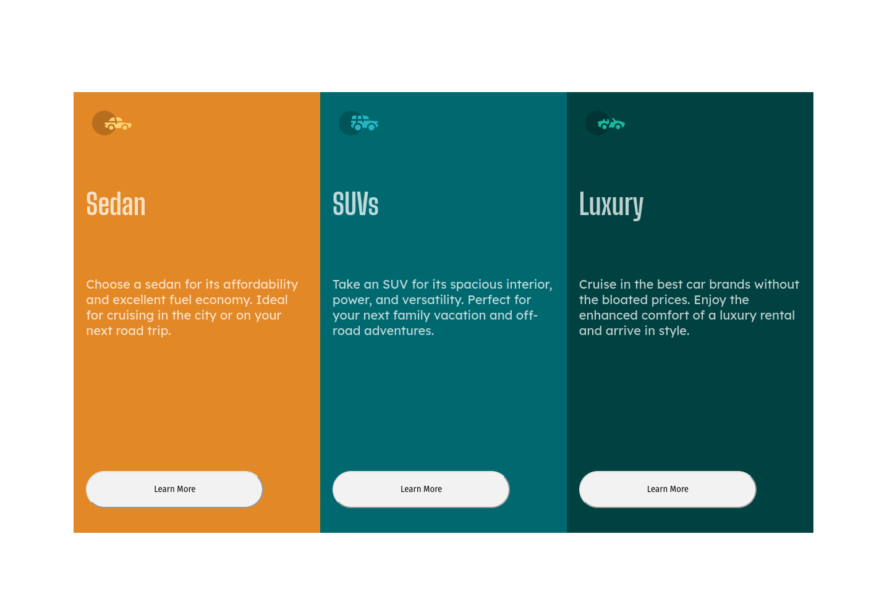
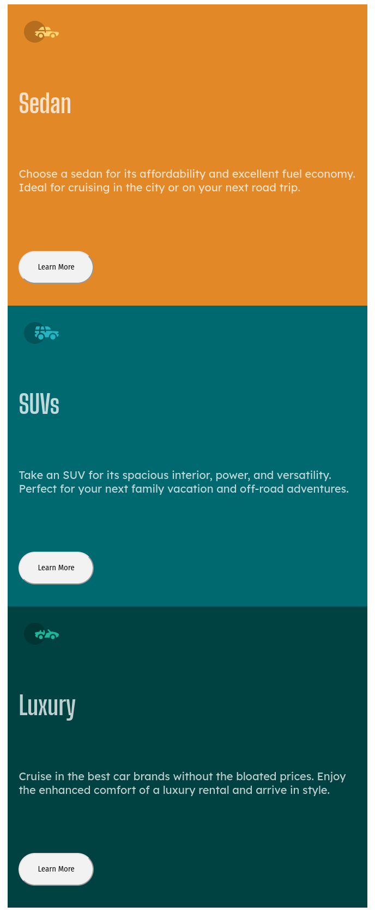

# Frontend Mentor - 3-column preview card component solution

This is a solution to the [3-column preview card component challenge on Frontend Mentor](https://www.frontendmentor.io/challenges/3column-preview-card-component-pH92eAR2-). Frontend Mentor challenges help you improve your coding skills by building realistic projects. 

## Table of contents

- [Overview](#overview)
  - [The challenge](#the-challenge)
  - [Screenshot](#screenshot)
  - [My process](#my-process)
  - [Built with](#built-with)
  - [What I learned](#what-i-learned)
  - [Continued development](#continued-development)
- [Author](#author)

## Overview

### The challenge

Users should be able to:

- View the optimal layout depending on their device's screen size
- See hover states for interactive elements

### Screenshot

## My process

### Built with

- Semantic HTML5 markup
- CSS custom properties
- Flexbox
- CSS Grid
- Mobile-first workflow
- [React](https://reactjs.org/) - JS library

### What I learned

I learned the basics of building web applications using React, a JavaScript library for building user interfaces. I gained experience with components, state, and props, as well as how to use JSX to create and render elements on the page. I am now able to build dynamic and interactive user interfaces that can update in real-time based on user input and data changes.

### Continued development

I have a solid foundation in building web applications using React, and I am now looking to expand my skill set by exploring other front-end frameworks. I am excited to learn new ways of building user interfaces and to compare the different approaches and benefits of each framework. This will allow me to make more informed decisions on which framework to use for future projects based on their specific requirements and goals.

## Author

- Website - [Keith Gaines](https://keithgaines.github.io)
- Frontend Mentor - [@keithgaines](https://www.frontendmentor.io/profile/yourusername)
